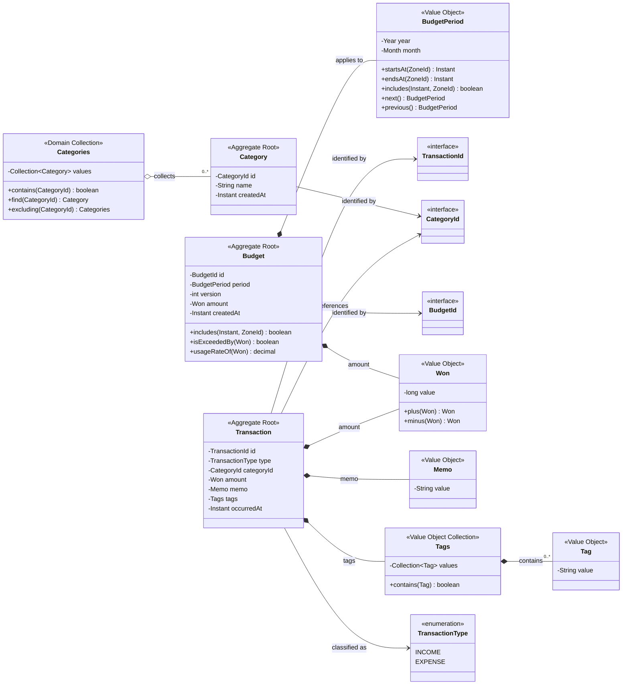

A: Aggregate
E: Entity
V: VO
I: Interface
ENUM: Java Enum
TIME: Java Time API

<공통 식별자>

TransactionId :I
CategoryId :I
BudgetId :I

<도메인 규칙이 존재해야 하는 객체>

Transaction :A, E
Category :E
Categories :A, collection
Budget :A, E

Won :V
Memo :V
Tag :V
Tags :V collection
BudgetVersion :V

TransactionType :ENUM

<객체 관계>

Transaction

* TransactionId
* TransactionType
* CategoryId
* Won
* Memo
* Tags
* Instant occurredAt

Tags

* Collection<Tag>

Categories

* Collection<Category>

Category

* CategoryId
* CategoryName
* Instant createdAt

Budget

* BudgetId(Year, Month, int version)
* Year
* Month
* int version
* Won
* Instant createdAt

